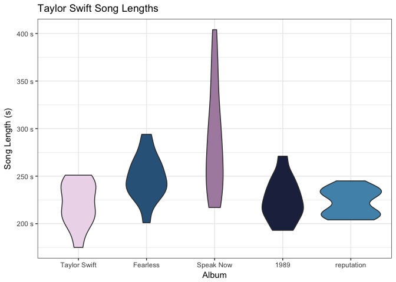

<!-- README.md is generated from README.Rmd. Please edit that file -->
rmusix
======

The goal of rmusix is to provide a simple wrapper for the [musixmatch](https://www.musixmatch.com) API. This API provides meta-data around artists, albums, and songs. It also provides song lyrics via API, **but full lyrics are currently only available under a [paid plan](https://developer.musixmatch.com/plans)**. A free API plan provides access to 30% of the lyrics for any given track.

Installation
------------

You can install `rmusix` from github with:

``` r
# install.packages("devtools")
devtools::install_github("blairj09/rmusix")
```

Usage
-----

The following example illustrates a typical use case for `rmusix`. Let's say that we want to look at details for all of Taylor Swift's songs and albums. First, we need to load the packages necessary and set our API key.

``` r
library(rmusix)
library(tidyverse)

# Set API Key
set_api_key(keyring::key_get("musixmatch"))
```

Now we need to find the `artist_id` for Taylor, which can be done using `search_artists()`.

``` r
ts_search <- search_artists("Taylor Swift")
ts_search
#> # A tibble: 10 x 7
#>    artist_id artist_mbid      artist_name     artist_country artist_rating
#>        <int> <chr>            <chr>           <chr>                  <int>
#>  1    259675 20244d07-534f-4… Taylor Swift    US                        94
#>  2  24451377 <NA>             テイラー・スウィフト… <NA>                      15
#>  3  34690605 <NA>             Taylor Swift f… <NA>                      61
#>  4  32915417 <NA>             ZAYN feat. Tay… <NA>                      61
#>  5  13920947 <NA>             B.o.B feat. Ta… <NA>                      39
#>  6  28705075 <NA>             Taylor Swift f… <NA>                      45
#>  7  14015404 <NA>             Taylor Swift f… <NA>                      45
#>  8  13903196 <NA>             Taylor Swift f… <NA>                      46
#>  9  13864003 <NA>             Boys Like Girl… <NA>                      41
#> 10  13814620 <NA>             Taylor Swift f… <NA>                      33
#> # ... with 2 more variables: artist_twitter_url <chr>, updated_time <dttm>
```

There she is in row 1. Now, we can use the `artist_id` to find all of her albums using `get_artist_albums()`.

``` r
ts_id <- ts_search[["artist_id"]][[1]]

ts_albums <- get_artist_albums(ts_id, page_size = 100)
head(ts_albums)
#> # A tibble: 6 x 12
#>   album_id album_mbid album_name             album_rating album_track_cou…
#>      <int> <chr>      <chr>                         <int>            <int>
#> 1 26806100 <NA>       reputation                      100               15
#> 2 27346738 <NA>       Call It What You Want             0                1
#> 3 27239439 <NA>       Gorgeous                         94                1
#> 4 26881848 <NA>       ...Ready For It?                100                1
#> 5 26805385 <NA>       Look What You Made Me…           89                1
#> 6 25251872 <NA>       I Don't Wanna Live Fo…          100                1
#> # ... with 7 more variables: album_release_date <date>,
#> #   album_release_type <chr>, artist_id <int>, artist_name <chr>,
#> #   album_copyright <chr>, album_label <chr>, updated_time <dttm>
```

We can see from the output of `get_artist_albums()` that we have singles mixed in with full album releases. While these can be identified using the `album_release_type` column, I've noticed that column sometimes stil allows Singles to slip in as full albums. Instead, we'll filter to full albums by filtering on `album_track_count`.

``` r
ts_full_albums <- ts_albums %>% 
  filter(album_track_count >= 5)

ts_full_albums
#> # A tibble: 28 x 12
#>    album_id album_mbid        album_name     album_rating album_track_cou…
#>       <int> <chr>             <chr>                 <int>            <int>
#>  1 26806100 <NA>              reputation              100               15
#>  2 20211386 <NA>              Taylor Swift …           82               13
#>  3 19649460 <NA>              1989                    100               13
#>  4 15342090 <NA>              Taylor Swift …           47               16
#>  5 14321209 647068db-4ea4-4a… Red Karaoke             100               16
#>  6 11327149 881aa3c6-86e6-4f… Red                     100               22
#>  7 15342070 <NA>              Speak Now: Wo…           28               16
#>  8 15342044 <NA>              Speak Now - W…           65               16
#>  9 26265854 <NA>              Speak Now Wor…           84               16
#> 10 12414703 481d0cba-6d9e-4f… Speak Now               100               14
#> # ... with 18 more rows, and 7 more variables: album_release_date <date>,
#> #   album_release_type <chr>, artist_id <int>, artist_name <chr>,
#> #   album_copyright <chr>, album_label <chr>, updated_time <dttm>
```

We still have a lot of duplicates in `ts_full_albums`, and a bunch of Karaoke albums as well. We can use `album_rating` to further filter down to albums we're interested in.

``` r
ts_full_albums <- ts_full_albums %>% 
  filter(
    album_rating == 100,
    !str_detect(album_name, "Karaoke|Platinum"))

ts_full_albums
#> # A tibble: 6 x 12
#>   album_id album_mbid            album_name  album_rating album_track_cou…
#>      <int> <chr>                 <chr>              <int>            <int>
#> 1 26806100 <NA>                  reputation           100               15
#> 2 19649460 <NA>                  1989                 100               13
#> 3 11327149 881aa3c6-86e6-4f5b-a… Red                  100               22
#> 4 12414703 481d0cba-6d9e-4fcc-b… Speak Now            100               14
#> 5 10889135 156671ad-34d7-41f6-b… Fearless             100               14
#> 6 10689014 f36b9775-89a8-4290-9… Taylor Swi…          100               11
#> # ... with 7 more variables: album_release_date <date>,
#> #   album_release_type <chr>, artist_id <int>, artist_name <chr>,
#> #   album_copyright <chr>, album_label <chr>, updated_time <dttm>
```

Now `ts_full_albums` contains all of Taylor's studio albums. Now, let's get the tracks from each of these albums using `get_album_tracks()`.

``` r
ts_tracks <- map_df(ts_full_albums[["album_id"]],
                    get_album_tracks,
                    page_size = max(ts_full_albums[["album_track_count"]]))

ts_tracks
#> # A tibble: 89 x 20
#>    artist_id artist_name        album_id album_name track_id track_name   
#>        <int> <chr>                 <int> <chr>         <int> <chr>        
#>  1    259675 Taylor Swift       26806100 reputation   1.34e8 ...Ready For…
#>  2  34690605 Taylor Swift feat… 26806100 reputation   1.34e8 End Game     
#>  3    259675 Taylor Swift       26806100 reputation   1.34e8 I Did Someth…
#>  4    259675 Taylor Swift       26806100 reputation   1.34e8 Don't Blame …
#>  5    259675 Taylor Swift       26806100 reputation   1.34e8 Delicate     
#>  6    259675 Taylor Swift       26806100 reputation   1.34e8 Look What Yo…
#>  7    259675 Taylor Swift       26806100 reputation   1.34e8 So It Goes...
#>  8    259675 Taylor Swift       26806100 reputation   1.34e8 Gorgeous     
#>  9    259675 Taylor Swift       26806100 reputation   1.34e8 Getaway Car  
#> 10    259675 Taylor Swift       26806100 reputation   1.34e8 King of My H…
#> # ... with 79 more rows, and 14 more variables: track_rating <int>,
#> #   track_length <int>, commontrack_id <int>, instrumental <int>,
#> #   explicit <int>, has_lyrics <int>, has_lyrics_crowd <int>,
#> #   has_subtitles <int>, has_richsync <int>, num_favourite <int>,
#> #   lyrics_id <int>, subtitle_id <int>, first_release_date <dttm>,
#> #   updated_time <dttm>
```

The final step is to add lyrics to all the tracks we now have using `get_track_lyrics()`.

``` r
ts_tracks <- ts_tracks %>% 
  mutate(lyrics = map_chr(track_id,
                          ~get_track_lyrics(.)[["lyrics_body"]]))

str(ts_tracks)
#> Classes 'tbl_df', 'tbl' and 'data.frame':    89 obs. of  21 variables:
#>  $ artist_id         : int  259675 34690605 259675 259675 259675 259675 259675 259675 259675 259675 ...
#>  $ artist_name       : chr  "Taylor Swift" "Taylor Swift feat. Ed Sheeran & Future" "Taylor Swift" "Taylor Swift" ...
#>  $ album_id          : int  26806100 26806100 26806100 26806100 26806100 26806100 26806100 26806100 26806100 26806100 ...
#>  $ album_name        : chr  "reputation" "reputation" "reputation" "reputation" ...
#>  $ track_id          : int  134319902 134319903 134319904 134319905 134319906 134319907 134319908 134319909 134319910 134319911 ...
#>  $ track_name        : chr  "...Ready For It?" "End Game" "I Did Something Bad" "Don't Blame Me" ...
#>  $ track_rating      : int  92 94 74 74 74 85 71 85 73 72 ...
#>  $ track_length      : int  208 245 238 236 232 212 228 210 234 214 ...
#>  $ commontrack_id    : int  75472741 74843426 74843429 74843417 74843420 74839385 74843421 76936938 74843419 74843422 ...
#>  $ instrumental      : int  0 0 0 0 0 0 0 0 0 0 ...
#>  $ explicit          : int  0 0 0 0 0 0 0 0 0 0 ...
#>  $ has_lyrics        : int  1 1 1 1 1 1 1 1 1 1 ...
#>  $ has_lyrics_crowd  : int  0 0 0 0 0 0 0 0 0 0 ...
#>  $ has_subtitles     : int  1 1 1 1 1 1 1 1 1 1 ...
#>  $ has_richsync      : int  1 1 1 1 1 1 1 1 1 1 ...
#>  $ num_favourite     : int  2992 2158 547 560 528 7352 308 315 440 393 ...
#>  $ lyrics_id         : int  17586056 17226557 17570266 17570272 17570288 17262724 17214417 17570298 17570316 17570332 ...
#>  $ subtitle_id       : int  18979938 18980327 18977573 18971555 18980817 18922401 18949444 18982416 18978565 18980718 ...
#>  $ first_release_date: POSIXct, format: "2017-09-03" "2017-11-10" ...
#>  $ updated_time      : POSIXct, format: "2018-02-27 03:53:11" "2017-11-13 14:35:43" ...
#>  $ lyrics            : chr  "Knew he was a killer, first time that I saw him\nWondered how many girls he had loved and left haunted\nBut if "| __truncated__ "I wanna be your end game\nI wanna be your first string\nI wanna be your A-Team\nI wanna be your end game, end g"| __truncated__ "I never trust a narcissist, but they love me\nSo I play 'em like a violin, and I make it look oh-so-easy\n'Caus"| __truncated__ "Don't blame me, love made me crazy\nIf it doesn't, you ain't doin' it right\nLord, save me, my drug is my baby\"| __truncated__ ...
```

Now, remember, since we're only using the free tier of the API, we only get 30% of the lyrics for each track. However, we also have a lot of other great metadata around each track that we can use as well. For example, we can look at the distribution of song lengths by album (for some reason the version of Red that we're pulling doesn't have data for `track_length`).

``` r
ts_tracks %>% 
  filter(album_name != "Red") %>% 
  ggplot(aes(x = fct_reorder(album_name, first_release_date), y = track_length, fill = album_name)) +
  geom_violin(show.legend = FALSE) +
  scale_y_continuous(labels = function(x) paste0(x, " s")) +
  nord::scale_fill_nord("lumina") +
  theme_bw() +
  labs(x = "Album",
       y = "Song Length (s)",
       title = "Taylor Swift Song Lengths")
```


